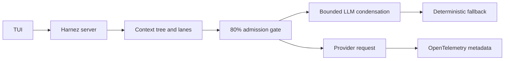

# Architecture

Harnez uses a local client/server architecture. Running `harnez` connects to
an existing server or starts one. From the outside, it should still feel like
one application.

## Runtime

The server is a long-lived process implemented in TypeScript on Bun. The TUI
stays thin. Expensive session and agent state lives on the server, not the
client, so the interface can be killed and reattached without losing work.
Each top-level request runs inside a fresh
[task runtime](/docs/architecture/task-runtime) with its own capability
snapshot and execution ledger.



At 80% of the usable input budget, admission targets 60%. When LLM compaction
is enabled, Harnez starts one bounded condensation operation and can retry
invalid output once. An unavailable or failed operation uses the deterministic
checkpoint fallback. With `HARNEZ_LLM_COMPACTION=0`, fallback waits until the
working set exceeds its budget. A provider context-length response creates a
recovery checkpoint retaining the current turn and retries once.

## Agent loop

A turn is a straight line: a user message goes through context construction
into a model call; tool calls come back, run, and their results feed back
into context for the next model call. It ends when the model responds
without requesting further action.

```text
User message → context → model call → tool calls
  → tool execution → tool results → context → model call → … → response
```

Three inputs steer that loop from the TUI:

- **Enter** modifies the active task in place. The model restarts around the
  new message.
- **Option + Enter** queues a follow-up task for after the current one
  finishes, without altering it.
- **Esc** aborts the current foreground step, including generation, running
  tools, and anything pending in that step.

## Subagents

Subagents are isolated agents with predefined profiles (`implementer`,
`explorer`, `reviewer`, and similar). A subagent doesn't inherit the parent's
whole transcript. It starts from its profile, relevant skills, applicable
repository instructions, and an explicit task brief. It reports back a
compact result: status, changes, verification performed, and anything
unresolved. The parent never imports a child's raw transcript.

## Context management

Harnez separates the lossless session history from the bounded working set
sent to a model. Every context item is tracked as `pinned`, `active`,
`retained`, or `archived`. System instructions remain protected; user messages
and explicit pins collapse into one bounded rolling summary only as a final
fallback. Tool output is externalized at creation. The model sees a bounded
preview and a reference it can use to recall the exact result later.

When the context budget reaches 80%, Harnez targets 60% of the usable input
budget. If LLM compaction is enabled, it attempts a bounded condensation before
archiving completed tool exchanges and work in a deterministic order. Failed
condensation uses the deterministic checkpoint fallback; disabled LLM
compaction defers fallback until the budget is exceeded. Capability content is
charged against the same final input budget.
Nothing is deleted; the full event history persists independently of what's
currently in the model's context. Main and child lanes share immutable prefix
nodes but have independent heads and revisions. Checkpoints record their
covered range and exact retained tail, so a restart reconstructs the same
provider-visible history.

## Tool discovery

Each task gets a capability catalog for workspace tools and model-invocable
skills. `capabilities_list` and `capabilities_search` return compact metadata;
`capabilities_inspect` returns one validated contract. A discovered tool can be
admitted with `tools_load`, while skills use `skills_activate`. Core workspace
tools are loaded when the task starts. See
[Tool discovery](/docs/architecture/tool-discovery) for the full flow.
