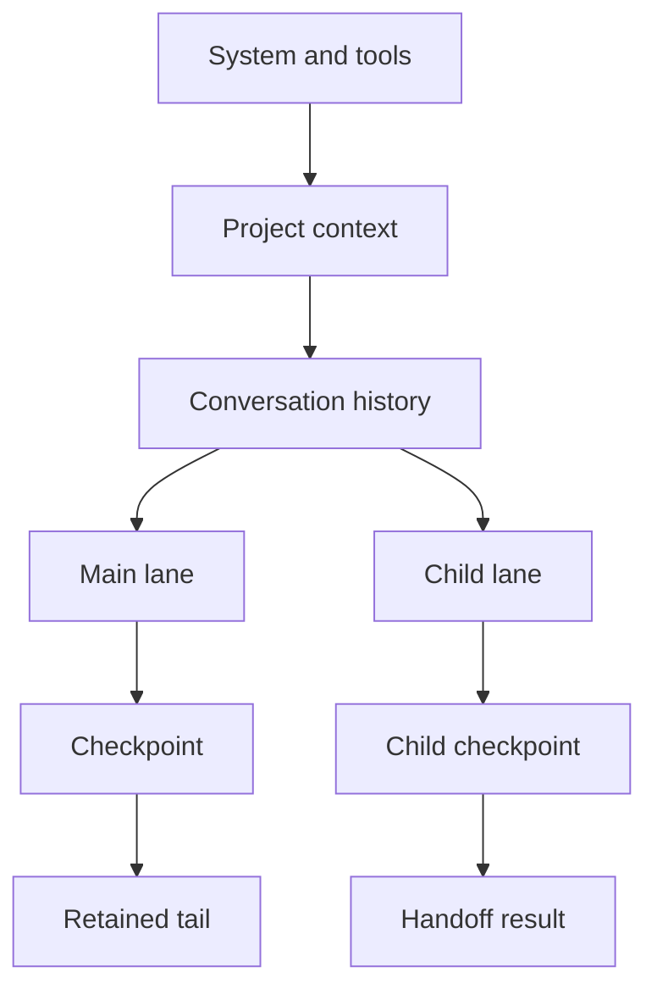

# Context compaction

An agent can fill its context window quickly. File reads and test logs may be
useful for one turn, while user instructions may need to stay available for the
entire session. Sending all of that history back to the model on every turn
wastes tokens and eventually stops fitting.

Harnez keeps the full session history separate from the smaller conversation
context it sends to the model:

```text
event log       = complete source of truth
model context   = bounded working set for the next turn
observations    = exact tool output stored outside the working set
repository      = durable result of completed actions
```

Only the model-facing working set is compacted. The event log, exact tool
output, and workspace files remain intact. Loaded tool schemas and activated
skill bodies use task-owned context, but their injected tokens count against
the same model input budget. See
[Task runtime](/docs/architecture/task-runtime).

The history is a persistent prefix tree. Child lanes share immutable prefixes
with the main lane and append their own branches. Checkpoints mark the
boundary between a shared prefix and the provider-visible tail.



The tree lets Harnez reuse immutable prefixes and evict replaceable branches.
Checkpoints never delete source items: exact history remains in SQLite and can
be recovered after a restart.

## Context lifecycle

Each stored conversation item moves through one of four states:

| State | What it contains | Can it leave the working set? |
| --- | --- | --- |
| `pinned` | User messages, system rules, explicit constraints, and durable decisions | User history and notes collapse into a rolling summary only as a last resort; system rules remain protected |
| `active` | The current turn and any open work episode | Not while active |
| `retained` | Completed turns and tool exchanges that may still help | Yes, when the budget is exceeded |
| `archived` | History kept in storage but represented compactly or omitted from the next model request | Already removed |

Harnez pins unknown item types rather than guessing that they are safe to
remove. When a top-level task ends, its user-visible assistant prose becomes
`retained` and therefore reclaimable; predecessor tool traffic is omitted.
Before reporting a budget error, Harnez collapses pinned user history and notes
into one bounded rolling summary. An error remains possible only when the fixed
overhead and smallest valid protected projection cannot fit.

## Tool output and observations

When a tool finishes, Harnez copies its exact output into an observation. Each
observation has an address:

```text
observation://obs-7c2f...
```

The model sees the result directly at first. If the result is large, it gets the
beginning and end with the observation address between them. After the exchange
is no longer active, Harnez can replace it with a short reference:

```text
Earlier read output was compacted.
Full output: observation://obs-7c2f...
```

The model can use `recall_observation` to read an exact slice of the archived
output. The observation URI accepts `offset` and `limit` query parameters, so a
targeted read looks like this:

```text
observation://obs-7c2f...?offset=12000&limit=4000
```

## Episodes and dependencies

For non-trivial work, the agent marks where an episode starts and ends:

- An `exploration` episode gathers information. It must end with a concise
  conclusion.
- An `action` episode changes the environment. It must name the completed
  exploration episodes it depends on.

```text
exploration: inspect-auth
  read auth.ts
  inspect callers
  inspect tests
  conclusion: JWT validation runs before route dispatch

action: fix-auth
  depends on: inspect-auth
  edit auth.ts
  run tests
```

The dependency records why an action was taken. Harnez can keep the relevant
investigation around until the action that used it has also been archived.

## Eviction order

Before each model request, Harnez recalculates the conversation working set and
includes the fixed cost of the permanent tool definitions. The default
conversation budget defaults to the model's usable input window. At 80%
pressure, Harnez aims for 60% of the usable budget.
When LLM compaction is enabled, Harnez attempts a bounded condensation when the
source prefix and a 4,096-token reserve fit. The LLM has no tools and must
return validated memory JSON. Invalid output can be retried once. An
unavailable, failed, or oversized attempt uses the deterministic checkpoint
fallback. Set `compaction.enabled` to `false` to disable the LLM attempt; the
fallback then runs only when the working set exceeds its budget.

The fallback keeps bounded active episode goals, recent anchors, completed
episode conclusions, and observation references. If the lane changes while an
LLM condensation is running, Harnez discards the stale result and replans with
the deterministic fallback.

For session history, it removes context in three passes:

1. Completed tool exchanges are compacted first. Writes and edits have early
   priority because their effects already exist in the repository. Reads use
   normal priority, while shell output and errors are kept longer.
2. If that is not enough, Harnez archives completed episodes. Action episodes
   go first. An exploration remains available until the actions that depend on
   it have been archived.
3. As a final fallback, pinned user messages and notes collapse oldest-first
   into one rolling summary, capped at about 400 tokens. Task assembly also
   keeps the two most recent pre-submission user messages verbatim and rolls
   older submissions into that summary.

Archiving an exploration removes its detailed trace from the working set. Its
conclusion and observation addresses stay. Harnez never considers an active
episode for eviction, and only compacts eligible pinned content in the final
fallback.

## Explicit condensation

The `condense_context` tool preserves completed work at a natural milestone
before automatic pressure. Its bounded JSON memory records completed work,
strategies and outcomes, environment changes, constraints, open questions, and
`observation://` or workspace-relative references. Calls are rejected while an
episode is active, for invalid references, or when the resulting memory exceeds
2,000 estimated tokens.

The next request has three segments: stable semantics (system and user
instructions, pinned decisions, task capability context, and active episodes),
one live long-term memory, and the four newest completed exchange groups plus
active items. Explicit condensation archives only eligible old assistant/tool
groups and completed episode content; user messages, system rules, pinned
notes, observations, active/current-task items, predecessor terminal messages,
and the newest four groups are protected. Exact observations remain recallable.
A replacement is written atomically and repeated calls replace the single live
memory. Automatic condensation uses one bounded operation and may retry invalid
output once. Explicit `condense_context` remains deterministic and does not make
a model call.

Automatic LLM and deterministic fallback attempts emit compaction lifecycle
events; successful explicit condensation emits an explicit event and the TUI
displays its milestone. A no-op or failed call leaves storage unchanged.
Pinned-history rolling summary remains the final emergency budget fallback.

For each stored conversation item, the context manager records its state,
projection, token cost, and the reason it was evicted. This information is
available from `GET /sessions/:id/context`. A provider context-length error
creates a fallback checkpoint that retains the current turn, then retries the
same request once. If the protected fixed envelope itself cannot fit, Harnez
reports an actionable input-size error instead of asking you to start a new
session.

## Task capability context

Tool schemas and activated skill bodies do not follow the conversation
lifecycle above. They belong to one task and have either `step` or `task`
scope. Harnez checks admission against a ceiling derived from the model's
usable input budget, with a 512-token safety margin. The old 8,000-token ceiling
is used only when the model cannot be resolved. Final request assembly charges
injected capability content and conversation history against the same budget.

If an item does not fit, admission reports the estimated need, safety margin,
and ceiling. Harnez does not evict capability context automatically. A manual
slash-skill that does not fit is skipped with a status message instead of
failing the task. Step-scoped items clear after one model step; task-scoped
items clear when the task ends, so a later task gets a fresh capability
snapshot and context.

## Subagent handoffs

The parent receives a structured result instead of the subagent's full trace.
The handoff contains its status, findings, decisions, changed files,
verification, unresolved issues, and artifact references. The parent keeps the
result it needs without adding every intermediate step to its own context.

Before admitting a task, Harnez repairs stale main-lane ownership and abandons
or fails inconsistent child-lane tasks. Abandoning a child lane closes its open
episode. Recovery emits `context.recovery.completed` with repair counts.

## Related work

The closest reference for Harnez's eviction model is
[Beyond Compaction: Structured Context Eviction for Long-Horizon Agents](https://arxiv.org/html/2606.11213v1).
Its Context Window Lifecycle design uses typed episodes, explicit dependencies,
and token accounting to choose what to evict without another model call.

[Context as a Tool: Context Management for Long-Horizon SWE-Agents](https://arxiv.org/abs/2512.22087)
takes a different approach. CAT divides the workspace into stable task
semantics, condensed long-term memory, and recent high-fidelity interactions. A
trained agent chooses when to compress older history. Harnez does not use that
learned compressor. Its eviction rules are deterministic, and archived
explorations keep the conclusions written by the agent.
