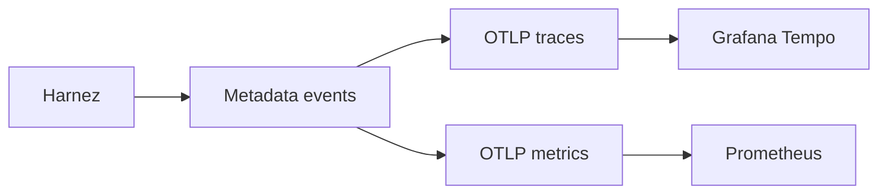

# Observability

Harnez exports lifecycle traces and metrics through OpenTelemetry when you set
`HARNEZ_OTEL=1`. Configure the standard OpenTelemetry environment variables:

```text
HARNEZ_OTEL=1
OTEL_SERVICE_NAME=harnez
OTEL_TRACES_EXPORTER=otlp
OTEL_METRICS_EXPORTER=otlp
OTEL_EXPORTER_OTLP_ENDPOINT=http://localhost:4318
```

The OTLP HTTP exporters honor signal-specific endpoints, protocol, headers,
resource attributes, and sampling from standard `OTEL_*` variables. Use this
minimal local collector configuration:

```yaml
receivers:
  otlp:
    protocols: { http: {} }
exporters:
  debug: {}
service:
  pipelines:
    traces: { receivers: [otlp], exporters: [debug] }
    metrics: { receivers: [otlp], exporters: [debug] }
```



Context lifecycle events include `context.prepare`,
`context.compaction.started`, `context.compaction.completed`,
`context.compaction.failed`, and `context.recovery.completed`. They expose lane,
trigger, token buckets, headroom, before/after totals, latency, retry count,
provider/model, and cache counts. They never expose source messages, summaries,
tool or MCP payloads, observations, image bytes, credentials, or filesystem
paths.

By default, events contain only IDs, status, durations, counts, model and tool
names, and context pressure fields. For local debugging, enable selected
payloads with a comma-separated list:

```text
HARNEZ_OTEL_CAPTURE_CONTENT=prompts,responses,tool-arguments,tool-results,mcp-payloads,paths
HARNEZ_OTEL_CAPTURE_MAX_CHARS=16384
```

`all` enables every category. `prompts` records the provider-facing system
prompt and message history, while `responses` records terminal assistant
messages. `tool-arguments` and `tool-results` cover built-in tools.
`mcp-payloads` independently covers MCP arguments and results. `paths` permits
path fields inside other enabled payloads.

Captured payload attributes default to 16,384 characters each. Set
`HARNEZ_OTEL_CAPTURE_MAX_CHARS` to a positive integer up to 1,000,000 to change
the limit. Truncation is marked with the original character count. Unknown
capture names and invalid limits fail startup.

Harnez removes credentials, API keys, authorization and cookie values,
environment maps, private keys, image bytes, and arbitrary binary values under
every setting, including `all`. Other private user text can still appear in
prompts, responses, and tool payloads. Use content capture only with a trusted
local collector, and disable it when the debugging session ends.

Prefix identity is computed locally from the provider, model, serializer
version, fixed envelope, capability context, tool schemas, and emitted provider
messages. Telemetry receives only a short HMAC alias. The HMAC key is generated
once and stored in local server metadata; it never leaves the machine.

## Local debugging in Grafana

Start Harnez against your local OTLP endpoint with full capture and detailed
lifecycle logging:

```text
HARNEZ_OTEL=1
OTEL_SERVICE_NAME=harnez
OTEL_EXPORTER_OTLP_ENDPOINT=http://localhost:4318
HARNEZ_OTEL_CAPTURE_CONTENT=all
HARNEZ_OTEL_CAPTURE_MAX_CHARS=16384
HARNEZ_LOG_LEVEL=debug
```

In Grafana Explore, select the Tempo data source and run:

```traceql
{ resource.service.name = "harnez" }
```

Open a trace and inspect `chat` spans for `gen_ai.input.messages` and
`gen_ai.output.messages`. Inspect `execute_tool` spans for
`harnez.toolArguments`, `harnez.toolResults`, or `harnez.mcpPayload`.
Prometheus contains aggregate counters and histograms, not individual
payloads.

Debug logs contain metadata only and do not duplicate captured content. A
managed macOS server writes them to
`~/Library/Application Support/harnez/server.log`; run
`tail -f ~/Library/Application\ Support/harnez/server.log` to follow them.

The useful context fields are `under_pressure`, `pressure_streak`, and
`agent_continued`. Use this collector query to find tasks that kept working
through repeated pressure:

```text
harnez.context.pressure_streak > 1 AND harnez.context.agent_continued = true
```

Metrics include `harnez.model.requests` and `harnez.model.tokens`,
`harnez.tool.calls` and `harnez.tool.duration`, plus context assembly,
compaction, live-token, history-token, and pressure-streak instruments.
Model metrics are labeled by provider, model, and status; tool metrics by tool,
source, and status; context metrics by trigger and outcome.

Harnez removes telemetry configuration, including both content-capture
variables, before bash and stdio MCP child processes start. Harnez does not
create distributed child traces.
